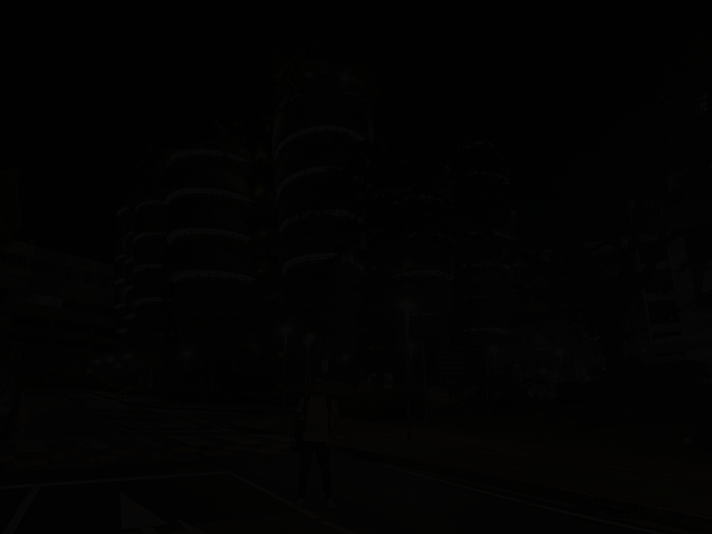

# HTC for low illumination image enhancement
## MATLAB implementation of low illumination image enhancement for night time pedestrian detection based on a hyperbolic tangent curve and BM3D (block matching and 3d filerting)
HTC is currently the state of the art low illumination image enhancement algorithm, howerver no public code for this algorithm is available. This implementation is based on 2 journal papers [1], [2]. First, low lighting image is enhanced by HTC [1], then the denoising technique - BM3D is applied to alliviate noise introduced after brightness enhancement.  
Two parameters in HTC_BM3D.m is the path to a low light image and sigma, which decides the degree of smoothness after raising brightness by HTC.


## Demo  
```bash
run demo.m
```

### Original low light image
<div align="center">
     
</div>

### Enhanced image by HTC-BM3D
<div align="center">
     
</div>

### References
[1] S. Liu, H. Wu, A. M. Rahman, S. C.-F. Lin, C. Y. Wong, N. Kwok, H. Shi and others, "Enhancement of low illumination images based on an optimal hyperbolic
tangent profile," Computers & Electrical Engineering, vol. 70, pp. 538-550, 2018.  
[2] W. Wang, Y. Peng, G. Cao, X. Guo and N. Kwok, "Low-Illumination Image Enhancement for Night-Time UAV Pedestrian Detection," IEEE Transactions on Industrial Informatics, vol. 8, pp. 5208-5217, 2020. 
